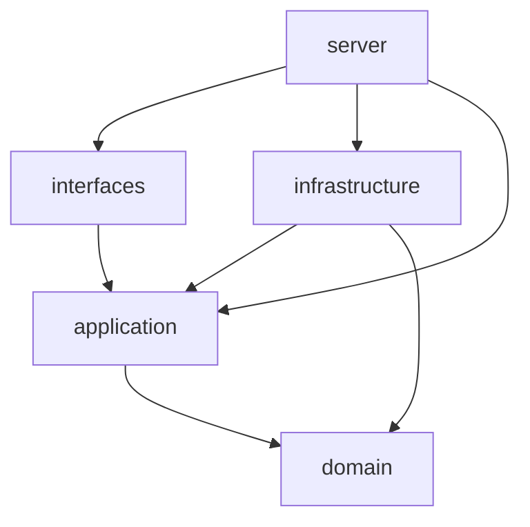

# Rust 博客架构设计

状态：设计基线，待实施。更新日期：2026-09-21。

## 1. 目标与范围

建设高性能、支持主题与模板渲染的 Rust 博客。默认面向单站点、个人或小团队运营，以及读多写少的访问模式。

范围按交付阶段拆分，统一里程碑详见 [功能路线](product-roadmap.md)：

- M1 内容闭环：PostgreSQL、Post/Page、单份正文的草稿/发布与 SSR 阅读，通过受控 CLI 或测试验证，不要求完整后台。
- M2 身份与后台：Owner/用户 CLI 开通、OIDC/GitHub、本地密码（Argon2id + 限流 + 受控重置）、RBAC、单实例内存会话、React SPA。作者可直接发布自己的文章，无强制审核。
- M3 可运营：分类树、标签、Series、settings 配置、MiniJinja 主题与模板数据函数、RSS、sitemap、SEO 及备份恢复。
- M4 扩展闭环：受限扩展、Webhook、外部搜索与统计接入能力；具体搜索/统计提供商待定。

完成内容规格、依赖与事务边界等开工前置项后即可推进 M1；M0 主题原型可独立并行，仅作为 M3 主题函数与相关缓存设计的前置，最后以 M5 验收上线。“首期”是这些阶段的交付目标，不是第一条纵向用例。首期只支持 PostgreSQL；其他数据库、审核、定时发布、评论、多语言和多实例按需演进，不承诺已经实现。

首期不引入微服务、事件溯源、独立读写数据库、多租户或任意插件代码运行时。推荐功能与待确认产品行为见 [决策登记表](product-roadmap.md)。

专项规格分别由 [内容生命周期](content-lifecycle.md)、[Domain](domain.md)、[身份与后台](identity-and-admin.md)、[主题与渲染](themes-and-rendering.md)、[扩展与数据](extensions-and-data.md)、[备份与恢复](operations-and-recovery.md) 维护；重大取舍见 [ADR](adr/README.md)。

PostgreSQL 的表、字段、约束及阶段集中在 [数据库设计](database-design.md)，附 [13 张核心表的 DDL 草案](sql/postgres-core.sql)。采用用户确认的 users/oauth_accounts、四张权限表、分类/系列/文章/标签关系、pages 和 settings；不预建路径、修订、媒体、会话、审计或队列表。不代表已经建立数据库表。

## 2. 核心决策

采用 **模块化单体 + 轻量六边形架构 + 按需使用 DDD**，通过 Cargo workspace 表达技术分层边界。

- 六边形架构用于隔离外部输入和外部能力；整洁架构的依赖向内原则同样适用，不额外叠加另一套分层。
- 聚合用于保护实际业务规则，简单设置和查询不强制套用复杂领域模型。
- 四层 + 独立装配入口，共五个 crate，表达技术职责，不等同于五个限界上下文。
- 层内按业务模块组织。业务上下文需要更强隔离时，再按上下文提取 crate。
- 多个 crate 最终组成一个服务进程；crate 不等于部署单位。

## 3. Workspace 与依赖

沿用当前项目的 crate 名称及位置：

```text
blog/
├── Cargo.toml
├── crates/
│   ├── domain/
│   ├── application/
│   ├── infrastructure/
│   ├── interfaces/
│   └── server/
├── docs/
├── apps/admin/       # 后台 SPA，独立前端项目，不是 Cargo 成员
├── themes/           # 后续新增
└── migrations/       # 后续新增
```

| Crate | 责任 | 允许的项目内直接依赖 |
|---|---|---|
| `domain` | 聚合、实体、值对象、领域规则与必要的领域事件 | 无 |
| `application` | 用例、端口、输入输出契约、权限和事务编排 | `domain` |
| `infrastructure` | 持久化、渲染、存储、缓存等出站适配器 | `application`、按需依赖 `domain` |
| `interfaces` | HTTP 等入站适配器、请求解析与响应映射 | `application` |
| `server` | 配置、具体依赖装配、启动、关闭和后台任务启动 | `application`、`infrastructure`、`interfaces` |

以下箭头表示编译依赖，不是请求流向：



`server` 构造适配器并注入应用服务，再交给路由。`interfaces` 不自行创建数据库连接池或模板引擎，不直接依赖 `infrastructure`。

每个 crate 的 `Cargo.toml` 显式声明实际需要的依赖。根目录的 `workspace.dependencies` 仅统一配置，不会自动给所有成员添加依赖。

### 第三方依赖准入

上表是现成的项目内依赖检查输入，不等同于第三方库枚举。第三方依赖按职责准入，新增库在实际使用时记录理由和必要 feature，不要求在开工前选定所有 UUID、时间或错误库。

| 层 | 第三方依赖政策 |
|---|---|
| domain | 可选择基础类型/错误库；禁止直接依赖 Axum、SQLx、MiniJinja、HTTP 客户端或运行时实现。序列化默认留给 DTO/行模型，例外需说明不变量保护 |
| application | 可选择 DTO 序列化、验证和基础抽象；禁止 Axum、SQLx、MiniJinja、具体外部服务 SDK，不绑定数据库或 HTTP 类型 |
| infrastructure | 可依职责引入 SQLx、MiniJinja、异步运行时及外部 SDK，不因同属此层就让所有适配器互相调用 |
| interfaces | 可使用 Axum、HTTP/JSON/OpenAPI 等传输库；禁止直接使用 SQLx、MiniJinja 绕过应用端口 |
| server | 可使用运行时、配置、日志及启动所需框架 API，负责装配而不实现业务规则 |

CI 先检查项目内边和明确禁止的框架直接依赖；第三方 feature 与传递依赖继续审查，不宣称仅靠名称黑名单可证明完全隔离。开发依赖例外必须有测试目的，不自动放宽生产依赖。这里是准入规则，不是声称这些库已经安装。

### 3.1 边界的保证范围

| 边界 | 保证方式 | 局限 |
|---|---|---|
| 跨 crate 使用 | Cargo 依赖声明和 Rust 可见性 | 修改 manifest 后可以扩大依赖，因此需要 CI 审查 |
| 聚合内部状态 | 私有字段和受控行为方法 | 需要正确设计公开 API |
| 模块内部实现 | 私有模块、限定可见性、白名单导出 | 已公开的类型可被所有合法依赖者使用 |
| 业务上下文依赖 | 明确契约、代码审查与架构检查 | 统一 `domain` 的公开聚合不能按调用者选择性隐藏 |

禁止宣称“用了 workspace 就自动隔离了所有业务上下文”。如果 Comments 必须在编译期无法访问 Authoring 聚合，应将相关上下文分成独立 crate，只公开用例或查询契约，并通过依赖规则约束访问。

## 4. 各层设计约定

### Domain

不依赖 Axum、SQLx、MiniJinja，不包含数据库行、HTTP 请求、模板上下文或框架错误。可以使用经过选择的基础类型库，不要求零第三方依赖。

字段默认私有，通过业务行为修改状态。目录和模型边界见 [Domain 设计](domain.md)。

### Application

按 `content`、`appearance`、`media`、`identity`、`site` 等业务模块组织用例，每个用例明确输入、输出、授权、事务范围和错误。

端口 trait 由使用方定义，例如 `PostRepository`、`PublishedPostQuery`、`ThemeRenderer`、`MediaStorage`（媒体文件存储，本地实现见 `infrastructure::LocalMediaStorage`）、`MediaRepository`、`Clock`。这些是职责示例，不要求首期全部创建。简单内部逻辑不为了形式增加 trait。

读操作可直接返回面向页面的 DTO；写操作通过聚合维护规则。采用轻量 CQRS，共用数据库，不必为读操作重建完整聚合。

应用层定义 `Actor` 等调用者契约。接口层验证身份后将外部凭据转换为该契约；用例通过 RBAC 与资源归属检查业务权限。前台提交的用户 ID 或角色不能直接作为可信身份。OAuth/OIDC 的外部身份不直接决定本站角色；当前账号由 CLI 显式创建并绑定，管理员邀请作为后续协作能力，不开放自助注册。

分页参数、用例错误和展示 DTO 由 application 持有，不需要共享错误基类或通用 `common` crate。domain 错误表达业务规则，适配器把数据库等技术错误映射为端口约定的错误。

### Infrastructure

实现端口并隐藏外部库类型。SQLx 行模型转换为领域模型或查询 DTO，数据库事务对象不暴露给 application。重建聚合需要专门的受控入口，不能通过公开全部字段解决。

### Interfaces

使用复数命名，代表 HTTP、未来的 CLI 等入站适配器，而不是 trait 集合。负责传输层校验（Content-Type、JSON 形状、请求大小）、身份提取、调用用例，以及把结果转换为 HTML、JSON 或其他响应。handler 将 slug 等原始输入作为应用命令字段传入，由 application 构造领域值对象；Slug 业务规则只在 domain 定义，不在 handler 重写正则。

业务合法性仍由应用层和领域层维护，不能仅依靠 HTTP handler 校验。

## 5. 发布、事务与一致性

发布文章的目标流程（当前只有一份正文，行为以 [内容生命周期](content-lifecycle.md) 为准）：

1. interfaces 解析请求并验证身份，形成发布命令。
2. application 检查权限，通过端口加载文章。
3. domain 校验状态和内容规则，执行发布转换。
4. application 在同一事务边界内保存聚合、版本和需要可靠处理的事件。
5. 提交后刷新文章页、列表、分类、RSS 等相关缓存。

事务端口的具体 Rust API 在首条纵向用例中确定，但必须满足以下约束：

- 一个用例内要求原子性的写入共享同一事务，仓储不得各自隐式提交。
- 事务或工作单元抽象由 application 定义，由 infrastructure 实现。
- 对外部存储的网络操作不假设能与数据库原子提交；通过暂存、补偿或重试处理。
- 并发编辑采用版本校验，版本冲突返回明确错误。
- 业务格式由领域值对象验证；跨聚合唯一性或竞争条件由应用用例协调，数据库约束或事务条件兜底，不能只靠预查询。当前验证 slug 唯一、Page 系统路由保留、分类树防环及系列位置；媒体引用随后续功能设计。

需要可靠的提交后处理时，事件与业务数据同事务写入 outbox。后台处理允许重试，消费者必须幂等。缓存失效采用重试和有界 TTL；不能把“提交成功”视为“所有缓存已刷新”。

内容事件以提交后的聚合版本表达顺序；相同正文撤回和再发布仍属于不同版本，当前没有修订 ID。删除墓碑、消费水位与重放遵循 [扩展与数据](extensions-and-data.md)，外部集成落地时再补充存储，M1 仅验证版本语义。分类/标签/系列关联与删除约束由内容生命周期统一定义。

草稿和预览始终绕过公共缓存。取消发布等可见性变更必须单独定义一致性要求：若要求提交后立即禁止访问旧页面，应在返回缓存前验证当前公开状态，或采用可验证的版本屏障；异步 outbox 与 TTL 本身不能保证立即撤回。

## 6. 主题与模板

已选产品技术：PostgreSQL、MiniJinja、React + TypeScript + Vite。HTTP/数据访问的工程建议为 Axum + Tokio + Tower、SQLx，尚待实施验证，不能把参考链接当作已经接入。具体版本与兼容性在实现时锁定。

公开站点使用 MiniJinja SSR，后台 SPA 使用管理 API，不共用主题模板。后台采用 React + TypeScript + Vite；登录接入通用 OIDC + GitHub。搜索、统计等通过端口接入，不能成为正文阅读的同步必要依赖。首期插件通过主题、Webhook 和配置式外部服务连接提供扩展，不执行第三方 Rust/WASM/JavaScript 服务端代码。

MiniJinja 的运行时模板能力用于无需重新编译的主题切换。不同主题是同一渲染适配器加载的资源，不应为每个主题新增 Rust 适配器。

```text
themes/default/
├── theme.toml
├── templates/
│   ├── base.html
│   ├── index.html
│   ├── post.html
│   ├── page.html
│   ├── archive.html
│   ├── taxonomy.html
│   ├── 404.html
│   └── partials/
├── assets/
└── settings.schema.json
```

主题清单包含 ID、主题版本、模板 API 版本、必需模板和资源入口。模板数据使用稳定的 `site`、`navigation`、`page`、`posts`、`pagination`、`theme` 契约，不传递数据库连接或领域聚合，允许模板通过注册的只读函数调用受控应用查询，不允许直接访问数据库或执行任意 SQL。函数契约、异步桥接、预算与缓存依赖见 [主题与渲染](themes-and-rendering.md)。

职责分配：

- domain：实际存在的主题标识、激活状态及业务约束。
- application：预览和激活用例、渲染及主题存储端口、渲染数据契约。
- infrastructure：清单解析、路径检查、模板解析、MiniJinja 渲染与资源读取。
- interfaces：页面路由、预览访问控制、HTML 响应。

激活流程：导入 → 校验文件及版本 → 解析模板 → 样例渲染 → 管理员预览 → 切换活动版本与缓存命名空间。进程内只在新实例完整可用后替换旧实例；失败继续使用旧版本。持久化激活记录与进程内切换需要明确恢复步骤，启动时按有效激活记录重建实例。多实例协调在扩展部署时另行设计。

生产请求复用已解析的模板，不扫描主题目录。预览不进入公共缓存。首期只支持管理员安装可信主题，不将模板引擎视为安全沙箱。

Markdown 转 HTML 后清洗，HTML 模板默认转义；禁止未经验证地使用安全标记。不能把普通 HTML 转义视为 JavaScript、CSS、URL 插值的完整保护；具体模板约束见 [主题与渲染](themes-and-rendering.md)。

## 7. 性能与运行保障

- Markdown 的清洗后 HTML、目录和摘要按内容 version 与处理器版本派生，先用有界内存缓存复用，未命中时生成；不为渲染结果增加核心表。
- M3 按验证结果启用有界内容缓存和公开页面缓存，缓存键包含影响输出的路径、查询参数、主题版本、内容或列表版本及必要的语言信息。
- 登录、后台、草稿、预览和个性化响应不使用公共页面缓存。
- 启用缓存后，热点重建合并请求，TTL 加抖动；发布、归档、主题和站点设置变更覆盖所有相关缓存依赖。
- 列表不读取全文，索引根据实际查询设计；避免 N+1。
- CPU 密集的内容转换和图片处理采用有界任务，避免阻塞异步执行线程。
- 主题包中的公共 CSS/JS 等静态资源使用指纹文件名和长期缓存；媒体附件遵循内容生命周期中的公开引用和撤回策略，不一律设为永久公开。公开页面按语义提供 ETag。
- M1 不启用页面缓存；后续单实例可采用有界进程内缓存。Redis、CDN、多实例按实际需求增加，缓存版本与撤回边界见主题设计。

初步验收目标：公开页面缓存命中服务端 p95 ≤ 20 ms，未命中页面缓存的文章页 p95 ≤ 100 ms，稳态压测错误率低于 0.1%，内存不持续增长。这些是待校准目标，不是已验证结果。测量必须记录硬件、数据量、正文大小、并发、持续时间和缓存状态，并确认响应内容正确。

除命中/未命中分类指标，还应测量持续发布、全站版本切换后的命中率、总体 p95/p99、缓存重建吞吐量和数据库负载。站点 generation 是保守提议，不能用热缓存数据代替发布期间的整体性能。

上线前需要请求追踪、指标、健康检查、超时、连接池限制、优雅关闭，以及数据库和媒体备份恢复验证。身份与上传链路需要会话安全、CSRF 防护、登录限流、文件大小和路径检查；本地密码的哈希与恢复方案已随 [ADR-0009](adr/0009-local-password-authentication.md) 落地（Argon2id、失败限流、受控 CLI 重置、泄露处置），自助邮箱找回仍未交付。

备份建议采用维护窗口内的数据库、媒体、主题与秘密材料一致清单；恢复先隔离，撤销旧凭据、重建派生数据并核对外部任务，再逐项开放服务。具体步骤与 RPO/RTO 验收见 [备份与恢复](operations-and-recovery.md)，取舍见 [ADR-0005](adr/0005-consistent-backup-and-recovery.md)。逻辑导出或数据库恢复成功本身不等于整个站点恢复成功。

## 8. 验证与实施顺序

架构检查应读取 Cargo metadata，依据 §3“允许的项目内直接依赖”表验证 workspace 成员的直接依赖白名单，并考虑不同 target、feature 和依赖种类。检查正常依赖与构建依赖，开发依赖单独审查；不能仅依赖 `cargo check` 证明架构正确。

测试按风险组织：

- domain：状态转换、值对象约束，不需要数据库或框架 mock。
- application：通过测试模块内的 fake 验证用例、权限和失败路径，无需依赖生产 infrastructure。
- infrastructure：真实数据库验证事务、唯一约束、版本冲突和查询；模板验证契约与转义。
- 服务集成：发布和阅读、草稿拒绝访问、主题失败回退、缓存失效与恢复。

实施顺序以 [功能路线 M0–M5](product-roadmap.md) 为唯一清单：完成开工前置项后做内容闭环，主题桥接原型可独立推进；正式身份与 SPA、运营功能、外部扩展依次交付，主题函数实现等待 M0 结论，最后上线验收。M1 不要求完成邀请、OAuth、自定义角色管理或前端工程。

测试位置约定：领域及应用测试靠近各自模块；数据库/迁移/适配器契约测试放 `crates/infrastructure/tests/`；完整装配和 HTTP 集成放 `crates/server/tests/`。后者可通过 server 库入口或启动服务子进程测试，不为测试公开领域内部字段。

当前使用脱敏运行/安全日志，不承诺数据库事务审计；未来引入 AuditWriter 时由 application 定义契约，infrastructure 实现事务持久化，interfaces 只提供请求上下文。缓存 generation 同样由 application 定义协调契约，domain 不持有缓存版本。

搜索以读模型和外部适配器起步，RSS 作为内容读模型的输出，不预设独立限界上下文。评论仍属于后续范围，出现独立业务规则后再评估边界。

## 9. 参考

- [Rust 可见性与隐私](https://doc.rust-lang.org/reference/visibility-and-privacy.html)
- [Cargo workspace](https://doc.rust-lang.org/cargo/reference/workspaces.html)
- [Cargo 开发依赖循环](https://doc.rust-lang.org/cargo/reference/resolver.html#dev-dependency-cycles)：部分 dev-dependency 循环被允许，但不作为默认测试结构。
- [Axum 中间件](https://docs.rs/axum/latest/axum/middleware/)
- [SQLx 查询宏](https://docs.rs/sqlx/latest/sqlx/macro.query.html)
- [MiniJinja 文档](https://docs.rs/minijinja/latest/minijinja/)
