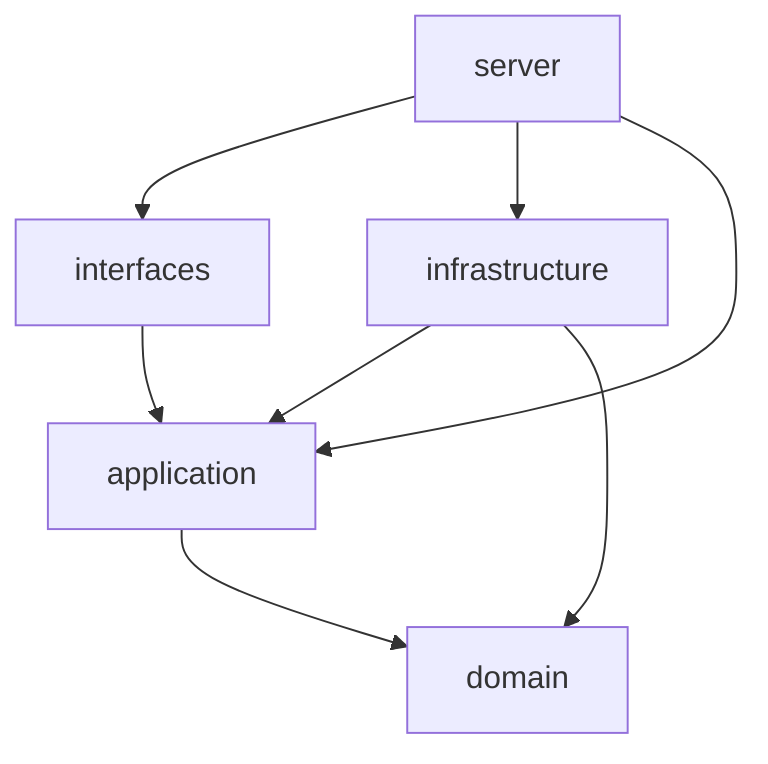

# 当前架构

本文说明已实现的代码边界与运行方式。项目是面向单站点、个人或小团队的模块化单体：Rust 服务提供公开 SSR、管理 API 和受控 CLI，React 后台单独构建，数据存储使用 PostgreSQL。后续能力统一见[产品路线图](product-roadmap.md)。

[ADR-0016](adr/0016-confirmed-blog-schema.md) 已采纳新的数据库方案，领域、仓储、渲染、定时任务和事务审计已按以下分层与业务提交原则适配。新表结构及剩余验收范围见[数据库设计](database-design.md)和[当前实现](database-current.md)。

## 五个 crate 与依赖方向

[Cargo workspace](../Cargo.toml) 用五个 crate 表达技术分层；它们共同组成一个服务进程，并不代表五个部署单元或五个业务上下文。

| Crate | 当前职责 | 允许的项目内生产依赖 |
|---|---|---|
| [domain](../crates/domain/src/lib.rs) | 聚合、值对象与业务不变量 | 无 |
| [application](../crates/application/src/lib.rs) | 用例、授权、出站端口、命令与查询 DTO | `domain` |
| [infrastructure](../crates/infrastructure/src/lib.rs) | PostgreSQL、渲染、媒体存储、密码、OAuth、会话等适配器 | `application`、`domain` |
| [interfaces](../crates/interfaces/src/lib.rs) | HTTP/CLI 输入解析、身份提取、路由与响应映射 | `application` |
| [server](../crates/server/src/main.rs) | 配置、按命令装配、监听与优雅关闭 | `application`、`infrastructure`、`interfaces` |

箭头表示编译依赖：

接口层调用应用用例，不创建数据库连接池或模板引擎。应用层定义所需能力，基础设施实现端口，`server` 注入具体实现。`domain` 只依赖 UUID、时间和错误类型库；`application` 使用基础类型、DTO 序列化与异步 trait，不在生产依赖中引入 Tokio、SQLx、Axum 或 MiniJinja。

[后台 SPA](../apps/admin/package.json) 不属于 Cargo workspace。它使用 React、TypeScript、Vite、Ant Design 和 TanStack Query，通过管理 API 访问同一应用层；公开主题与后台组件各自独立。

首次安装属于部署生命周期：`application::installation` 定义输入、初始凭据校验及安装端口，`interfaces::http_install` 提供内嵌页面和 HTTP 边界，`server::installation` 保存本地配置并装配站点，`infrastructure::installation` 实现空库检查和原子权限/Owner 初始化。连接配置先安全落盘，数据库完成标记与 Owner 同事务提交；动态路由在成功后原地切换，随后才启动预约发布任务。故障续装与部署边界见[首次安装](installation.md)。

## 模块与公开契约

[应用端口入口](../crates/application/src/ports/mod.rs) 使用私有子模块和显式导出；调用方使用 `application::ports`，不依赖端口文件布局。

| 端口模块 | 主要契约 | 对应适配器 |
|---|---|---|
| `content` | Post/Page 提交、完整文章记录、公开查询 | [persistence/content.rs](../crates/infrastructure/src/persistence/content.rs) |
| `content_queries` | 后台文章/页面摘要分页，不依赖写聚合 | [persistence/content_queries.rs](../crates/infrastructure/src/persistence/content_queries.rs) |
| `taxonomy` | 分类、标签、系列及排序 | [persistence/taxonomy.rs](../crates/infrastructure/src/persistence/taxonomy.rs) |
| `identity` | 用户、权限、身份提供商、密码、会话 | `persistence/identity.rs`、`rbac.rs`、`oauth.rs`、`password.rs`、`sessions.rs` |
| `media` | 资产、引用、文件存储 | `persistence/media.rs`、`media_storage.rs` |
| `site` | 站点与活动主题设置 | `settings.rs` |
| `rendering` | `ContentRenderer`、`RenderedContent`、`ThemeRenderer` | `render_executor.rs`、`rendering.rs` |
| `runtime` | 时钟、健康检查与通用保存结果 | `persistence/connection.rs` 等 |

身份端口按调用能力拆成 `UserQuery`、`UserProfileStore`、`AccountAdministration` 与 `PasswordCredentialStore`。角色用例只依赖账号读取，密码用例依赖账号读取和凭据端口，用户用例通过 `UserStores` 注入读取、资料提交与账号管理；不再把全部用户存储能力交给每个调用方。`PostgresUserRepository` 实现这些窄端口，共用连接池，资料/头像与引用、账号状态与会话撤销、凭据变更与审计仍由各业务提交方法原子执行。

[持久化入口](../crates/infrastructure/src/persistence/mod.rs) 同样显式导出适配器，内部拆为 `connection`、`content`、`content_queries`、`identity`、`media`、`taxonomy`、`sql`。行映射、SQL 错误映射和事务 helper 保持私有或限定可见性；媒体引用锁、身份锁按实际复用范围在基础设施内部共享。数据库连接与事务对象不进入应用端口。

身份规则分为纯判断与事务执行：`application::identity::policy` 负责账号状态变更的权限/版本/幂等顺序及最后可登录 Owner 阈值；`domain::identity::LoginMethods` 负责登录方式保留规则。基础设施在统一身份排他锁内重新读取事实后调用规则，继续在同一事务撤销会话、维护版本与追加审计。后台账号提示复用相同规则，展示数据不能作为写入授权凭据。

应用用例按实际功能文件组织，包括 `content`、`content_queries`、`page`、`tag`、`category`、`series`、`identity`、`auth`、`password`、`media`、`settings`、`public_site` 等；没有通用 `common` crate、每表一个用例或通用工作单元框架。

站点生效信息与字段回退规则集中在 [site_info.rs](../crates/application/src/site_info.rs)，设置、公开展示、SEO 和渲染端口共用这一契约，设置与公开用例不互相依赖。RSS/sitemap 用例只返回结构化数据；XML 转义、协议日期格式、robots 文本及 HTTP 响应由接口层负责，不依赖主题。

## 内容读写边界

写入通过聚合维护业务规则，通过仓储端口表达一次原子提交：

1. 接口解析输入并建立可信 `Actor`；应用检查写入渠道、权限和资源归属。
2. 以 UUID 加载内容。文章正文、版本和标签由同次读取的 `PostRecord` 提供，应用检查调用方版本前提。
3. 聚合通过创建、编辑、发布、撤回或回收站行为产生新状态；无实际变化时不提交新版本。
4. 基础设施在数据库事务外调用异步 `ContentRenderer::render_content`，同次生成清洗后的 HTML 与正文媒体引用。
5. 仓储执行版本条件更新，将源文、`content_html`、渲染规则版本、标签和媒体引用一起提交；系列成员变化同时维护相关系列版本。
6. 返回本次提交的记录。文章响应不在提交后另查标签拼装，也不由应用修改快照字段模拟提交结果。

Post/Page 的写端口接收领域聚合，快照用于读取和重建。事务规则由具体业务提交端口定义，SQL 事务由基础设施持有；当前不引入任意仓储拼接的通用工作单元。文件操作不能与 PostgreSQL 原子提交；媒体先完成暂存与文件就位，再提交元数据及审计。软删除只改变数据库状态，暂存维护只清理超期暂存。正式媒体按显式计划清理：先事务提交删除与审计凭据，再按凭据删除文件；提交结果不确定时保留文件，用原计划重试。细节见[运维](operations-and-recovery.md#正式媒体物理清理)。

Post/Page 管理 API 及 Post CLI 通过稳定 UUID 定位资源，公开 URL 使用 slug；当前没有 Page CLI。草稿改名不改变管理身份，Post/Page 没有旧 slug 管理接口的兼容分支。具体版本、删除和路径规则见[内容生命周期](content-lifecycle.md)与[管理 API](admin-api.md)。

后台普通列表及回收站统一由 `ContentQueries` 授权，依赖 `AdminPostQuery` / `AdminPageQuery` 窄端口；Post CLI 也走这条路径。Post/Page 写仓储只保留聚合加载与提交，不承担列表查询。独立查询适配器只投影列表展示字段，不读取 Markdown、HTML 或关联集合；固定每页 20 条，支持状态/可见性筛选，同一个只读 REPEATABLE READ 事务读取总数和分页。稳定排序以 UUID 打破时间戳并列；跨请求不承诺冻结快照。

公开读取采用面向页面的查询 DTO，共用同一个数据库，不为公开读取重建聚合。公开 Post/Page 查询只返回 `published + public + 未软删除 + 发布时间已到` 内容；公开详情直接使用持久化 `content_html`。sitemap 按剩余额度限制文章、Page 和三类目录的 SQL 查询，所有来源共用 50,000 条上限，耗尽后跳过后续查询。当前没有公开页面缓存或跨请求主题查询缓存，每次请求重新读取公开状态。浏览器和代理的缓存行为仍取决于部署配置，应用内部无缓存不等于能够撤回已发送的响应。

渲染执行、正文派生物回填及预算见[主题与渲染](themes-and-rendering.md)；当前表和锁协议见[数据库实现参考](database-current.md)。

## 按命令装配

[main.rs](../crates/server/src/main.rs) 先解析命令、连接数据库，再选择迁移和所需依赖。[assembly.rs](../crates/server/src/assembly.rs) 提供窄依赖构造，[website.rs](../crates/server/src/website.rs) 专门装配网站。

| 命令 | 迁移范围 | 装配范围 |
|---|---|---|
| `migrate` | 结构迁移，完成后退出 | 数据库 |
| `rebuild-html` | 结构迁移或校验后显式重建旧渲染版本 HTML | 数据库与正文/评论渲染运行时 |
| `user`、`role`、`oauth` | 结构迁移 | 对应身份用例；不读取网站 URL 或主题 |
| `media` | 结构迁移 | 媒体仓储与文件存储 |
| `post` | 结构迁移 | 用户、内容用例及本次写入的正文渲染 |
| `publish-due` | 结构迁移 | 到期发布用例及原子批次适配器 |
| `maintenance` | 不执行迁移或派生物回填 | 独立维护连接与保留期清理用例 |
| `serve` | 结构迁移 | 网站配置、全部用例、主题、静态资源与 HTTP 状态 |

除 `migrate`、`rebuild-html` 与独立的 `maintenance` 外，其余命令在执行前同步权限注册表。只有 `serve` 读取网站配置并加载主题；主题目录损坏或公开 URL 无效不会阻止账号、密码、OAuth 或 HTML 维护。配置项见[配置参考](configuration.md)。

结构迁移与 HTML 重建没有组合入口：普通启动和业务命令仅调用 `migrate_schema`，不会扫描全库旧渲染版本。`rebuild-html` 与结构迁移同属基础设施维护，由接口层解析命令、`server` 分派，基础设施持有渲染、CAS、引用同步与审计事务。历史内容重建失败只影响显式维护进程；规则升级需要在部署流程安排重建，见 [ADR-0017](adr/0017-explicit-html-rebuild.md) 和[运维步骤](operations-and-recovery.md#html-显式重建)。

服务装配共享一个 `RenderingRuntime`，供 Post/Page 仓储及所有主题使用。接口层组合 HTTP 路由；监听 socket、连接信息和退出信号由 `server` 持有。默认主题必须加载成功，其他无效主题被跳过；详见主题文档。

完整 HTTP 路由统一由 `interfaces::http::app_router` 组合，包括评论、审计和保留期设置。`server::website` 仅构造用例、资源与 `HttpConfig`；请求编号中间件和可信代理配置在接口层统一挂载，子路由保留各自的认证、请求体和缓存规则。

预约发布由 `application::publishing::PublishDueInteractor` 编排，受控 CLI 和每 30 秒的定时触发共用同一用例；`server` 只持有定时器、恢复隔离与关闭策略。`ScheduledPublicationStore` 在基础设施中以 `SKIP LOCKED` 执行 Post/Page 原子批次，保持状态、版本和审计一致。错误返回后已提交批次保持生效，下一次触发继续处理剩余到期内容。

保留期清理由 `application::retention::RetentionMaintenance` 校验批次参数并聚合结果；`RetentionCleanupStore` 每批在锁内重读策略，事务内清理并审计。达到批次上限或因行锁没有进展时返回 `has_more`，避免忙循环；dry-run 只统计一次，不计入已执行批次。独立维护凭据及恢复隔离守卫仍由部署入口控制。

## 架构检查与验证

[依赖检查脚本](../scripts/check_dependencies.py) 读取未按当前平台过滤的 Cargo metadata，检查 normal/build/dev 依赖、可选依赖、target 条件及重命名依赖：

- 项目内依赖使用上表白名单；`server` 集成测试可额外依赖 `domain`，不放宽生产边界。
- `domain` 和 `application` 的第三方依赖使用明确白名单；应用测试允许 Tokio。
- `interfaces` 禁止直接引入 SQLx、MiniJinja 及其子包。
- 新 workspace 成员或第三方内层依赖需要同步审查规则。

脚本已接入 [CI](../.github/workflows/ci.yml) 和 [scripts/check.sh](../scripts/check.sh)，并有[检查器自身的测试](../scripts/test_check_dependencies.py)。它检查直接依赖，不能证明传递依赖、feature 行为或同一 crate 内所有业务模块都已隔离；这些仍依赖可见性、契约与代码审查。

领域纯单元测试验证状态与不变量，应用 fake 端口测试验证授权和冲突，PostgreSQL 集成测试验证事务与并发，HTTP/CLI 测试验证装配及传输契约，前端测试验证编辑与请求行为。运行方式见[开发指南](development.md)。

## 取舍与后续方向

当前以单进程、单数据库和业务提交端口保持可理解的一致性边界。运行时与业务规则已分离，但没有实现 outbox、外部搜索、Webhook、任意插件运行时或全站缓存 generation；这些能力的需求、验收门槛和顺序见[产品路线图](product-roadmap.md)与[扩展设计](extensions-and-data.md)。历史决策保留在 [ADR](adr/README.md)，不作为已交付功能清单。
