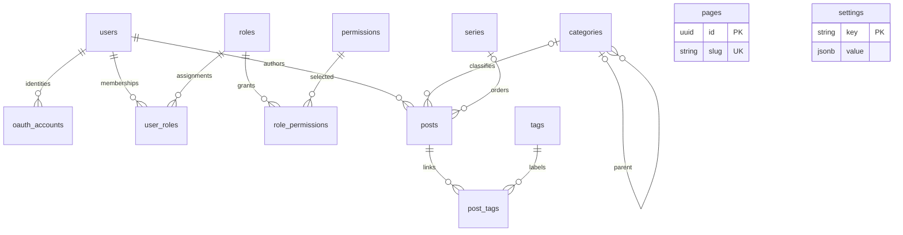

# 数据库设计：13 张核心表

更新日期：2026-09-21。采用用户提供并确认的方案：少表、关系清晰、以后再扩展；包含 Series、RBAC、OAuth，Post/Page 分表。替代此前 14 表与发布修订方案，取舍见 [ADR-0008](adr/0008-thirteen-table-blog-core.md)。

完整字段、类型、约束与索引见 [PostgreSQL DDL](sql/postgres-core.sql)。这是面向空 schema 的设计草案，不是已执行的数据库迁移。保留原方案的 13 张表和业务字段，只补充必要的约束、索引，以及可变记录的 `version` 并发控制字段；不增加路径、修订、会话或审计表。

## 1. 表与关系

| 范围 | 表 | 关系与用途 |
|---|---|---|
| 身份 | users | 本站用户，与登录方式分离 |
| 身份 | oauth_accounts | 一个用户可绑定多个外部身份 |
| 权限 | roles | 内置和自定义角色 |
| 权限 | permissions | 以 resource.action 为 key 的权限目录 |
| 权限 | user_roles | 用户与角色多对多 |
| 权限 | role_permissions | 角色与权限多对多 |
| 内容 | categories | 分类树，一篇文章至多一个分类 |
| 内容 | series | 有序系列，一篇文章至多一个系列 |
| 内容 | posts | 当前文章正文、归属、状态与系列顺序 |
| 内容 | tags | 标签 |
| 内容 | post_tags | 文章与标签多对多 |
| 内容 | pages | 独立页面，不关联分类、标签、系列或作者 |
| 系统 | settings | 按 key 分组的 JSONB 配置 |



UUID 由应用生成；时间统一用 timestamptz。状态用字符串和 CHECK；updated_at 在更新时由应用写入，DEFAULT now() 仅处理插入。正文和 JSON 大小由接口及应用限制，不能因为 SQL 用 text/jsonb 就接受无限输入。

users、roles、categories、series、posts、tags、pages、settings 额外有 `version bigint`，初始 1。有变化的写入校验 expected_version 并递增；修改文章标签也递增 posts.version，修改角色授权也递增 roles.version。它只表示当前记录的提交版本，不代表存在修订历史。

## 2. 用户与 OAuth

| 表 | 字段 | 说明 |
|---|---|---|
| users | id、username、email、password_hash、display_name、avatar、created_at、updated_at、deleted_at | username 唯一；email 可空且唯一；password_hash 可空；deleted_at 非空即禁止认证及后台操作 |
| oauth_accounts | id、user_id、provider、provider_user_id、email、created_at、updated_at | user_id 为 FK；唯一 (provider, provider_user_id)，不保存第三方 token |

username 和用户主邮箱在写入前采用固定规范化策略，软删除后仍占用唯一值；OAuth email 只是资料快照，不唯一，也不用于自动合并账号。OAuth 返回同邮箱时不能直接绑定到已有用户，绑定必须由已登录且重新认证的用户明确发起。

provider 表示稳定的提供商实例，而不只是任意的“oidc”字符串：OIDC 使用精确 issuer 作为身份命名空间，GitHub 使用固定平台实例标识；provider_user_id 分别使用 sub 或稳定数值用户 ID。配置别名、显示名或 GitHub login 不能替代身份键。

`password_hash` 存 Argon2id 的 PHC 字符串（算法与参数自描述，可透明升级），OAuth-only 用户为空。本地密码登录、限流、重置与泄露处置契约见 [身份与后台 §7](identity-and-admin.md)；自助找回需要一次性令牌存储与邮件投递，本版未交付。只做登录时不长期保存 access_token/refresh_token；以后调用第三方 API 再单独设计加密凭据存储。

users 的业务引用默认 RESTRICT；账号优先软删除/匿名化，不能级联删除其文章。avatar、cover 是 URL/受控静态资源路径，不是已经实现上传、附件引用或文件回收。

## 3. RBAC

| 表 | 字段 | 主键/唯一约束 |
|---|---|---|
| roles | id、name、slug、description、created_at、updated_at | PK id；UQ slug |
| permissions | id、name、key、description | PK id；UQ key |
| user_roles | user_id、role_id | PK (user_id, role_id) |
| role_permissions | role_id、permission_id | PK (role_id, permission_id) |

用权限 key 检查业务动作，如 `post.create`、`post.update`、`post.publish`、`page.update`、`category.manage`、`settings.manage`；角色只是授权集合，不用角色名称替代动作检查。用户可持有多个角色，权限取并集。不增加用户直授权、角色继承、ACL 或规则脚本。

permissions 由可信应用注册表同步，不允许普通后台创造任意“可执行权限”。自定义角色从已注册 key 选择；未知 key 默认拒绝。原方案的 action/scope 关系行改为 permission_id 外键，范围由 key 的可信描述符定义。

为保留作者只能管理自己文章的要求，建议 `post.update/post.publish/post.delete` 表示 own；`post.update_any/post.publish_any/post.delete_any` 表示 any。同理补充 post.read、post.read_any、post.purge、post.transfer_author 等确有用例的动作。Author 获得 own，Editor 获得所需 any；后端仍读取 author_id 校验。Page 无 author_id，page.* 采用站点范围，不给 Author 默认页面管理权。

Owner 保留为受保护的内置角色 slug；普通角色 API 不能创建、重命名为或修改该角色。首次 CLI 初始化显式绑定目标外部身份，禁止首个任意登录者自动成为 Owner。委派上限由可信策略限制，角色编辑前后、角色分配/移除都检查受影响权限；最后有效 Owner 不能被删除或降级。

敏感业务写入与身份变更使用统一事务锁协议，授权后再检查记录版本；初期每次敏感操作读主库，不缓存有效权限。具体协议见 [身份与后台](identity-and-admin.md)，权限表的 FK 本身不能阻止业务提权。

## 4. 分类、系列和标签

| 表 | 字段 | 规则 |
|---|---|---|
| categories | id、name、slug、parent_id、description、created_at、updated_at | slug 唯一；parent_id 自引用，可空；不允许自身或祖先形成环 |
| series | id、name、slug、description、cover、created_at、updated_at | slug 唯一；顺序在 posts 中维护 |
| tags | id、name、slug、created_at | slug 唯一 |
| post_tags | post_id、tag_id | 复合主键，避免重复标签 |

分类表示主题归属，系列表示阅读顺序；二者可以同时存在。文章可无分类、无系列、无标签。一篇文章最多一个分类和一个系列，不建 post_categories 或 post_series。

posts.series_id 与 series_order 必须同时为空或同时非空；序号为正整数，允许留空档。唯一 (series_id, series_order)，同系列不允许重复位置，草稿和回收站文章也占用自己的位置。无系列文章的两列为 NULL，默认唯一约束允许多条此类记录。[PostgreSQL 唯一约束](https://www.postgresql.org/docs/current/ddl-constraints.html)

重排同系列时锁定 series 行，校验 series.version，在同一事务更新涉及文章的顺序与版本，并递增系列版本。跨系列移动按 ID 顺序锁两个系列。DDL 将位置唯一约束设为可延后检查，交换位置时执行 `SET CONSTRAINTS posts_series_position_unique DEFERRED`，提交时必须恢复唯一。[PostgreSQL SET CONSTRAINTS](https://www.postgresql.org/docs/current/sql-set-constraints.html)

标签部分已随 M3 第一段交付：`tags`（name ≤100 字符、trim 后非空、slug 创建后不可修改、version 支持改名 CAS）与 `post_tags`（复合主键去重、post_id CASCADE、tag_id RESTRICT）经迁移建表并有仓储实现；文章与标签关系在保存文章的同一事务整体替换，仅标签变化也递增 posts.version；被引用标签（含草稿/私密/回收站引用）的删除在业务层与 FK RESTRICT 双重拒绝。

分类 parent_id 的 CHECK 只防自身引用；所有创建、移动和删除分类的入口都取得统一树结构事务锁，再检查完整祖先链，防止并发形成多节点环。被文章或子分类引用的分类、被文章引用的系列/标签默认拒绝删除；先显式调整关系，不靠 CASCADE 静默改变文章。

分类、标签、系列名称读取当前值，没有历史关联快照。公开列表、系列顺序与标签计数只统计当前公开文章，不泄漏草稿或私有文章。

## 5. Post 与 Page

| 表 | 业务字段 |
|---|---|
| posts | id、author_id、category_id、series_id、title、slug、excerpt、content、content_type、cover、series_order、status、visibility、published_at、created_at、updated_at、deleted_at |
| pages | id、title、slug、content、content_type、status、visibility、published_at、created_at、updated_at |

content_type 首期仅允许 markdown；不接受未经处理的 HTML 作为另一种存储格式。status 为 draft/published/archived，visibility 为 public/private；后续确需定时、密码访问或 unlisted 时再扩展。published_at 表示第一次发布的时间，重新发布不重置。

文章公开条件为 `status = 'published' AND visibility = 'public' AND deleted_at IS NULL`；页面为前两项。所有详情、列表、RSS、sitemap、模板函数和未来搜索都使用同一条件。私有内容只通过有授权的后台/预览入口访问，知道 slug 不等于有权读取。

**本版只保存一份正文。保存已发布内容及标签会直接更新线上；没有“未发布的编辑副本”或历史恢复。** 草稿可自动保存，已发布内容默认关闭服务端自动保存，使用明确的“保存并更新线上”操作；若需不公开地编辑，先撤回为 draft。浏览器本地暂存不等于数据库修订。

草稿标题和正文可暂空，但 slug 创建时就必须非空且表内唯一；由用户提供或应用生成临时唯一 slug。首次发布校验内容与路径，之后锁定 slug，即使撤回也不允许改名。无路径历史、自动重定向或删除墓碑。

建议路由：文章 `/posts/{slug}`，页面 `/{slug}`，分类/标签/系列分别为 `/categories/{slug}`、`/tags/{slug}`、`/series/{slug}`。Page slug 仅为一个片段，应用拒绝 admin、api、auth、posts、categories、tags、series、assets、media 及 RSS/sitemap 等实际系统路由；路由优先匹配系统入口，最后才进入 Page。数据库的 pages.slug 唯一无法单独保护系统命名空间。

posts 软删除保留 slug、系列位置及标签关系；恢复后为 draft，原 archived 仍保持 archived。默认不自动清空回收站，永久删除需专门授权，级联清除 post_tags 并释放 slug/系列位置。pages 按贴文无 deleted_at：删除为物理删除，需 page.delete 权限，无法从回收站恢复。永久删除后的旧地址可被新内容使用；如需永久占位必须另行扩展。

## 6. Settings

settings 保存 `key、value、updated_at`，附并发 version。key 为 site/theme/seo/oauth 等分组；value 为 JSON 对象，可在对象中包含 schema_version，由应用按分组验证结构和大小。

```json
{
  "schema_version": 1,
  "title": "Sun's Blog",
  "description": "一个 Rust 博客",
  "logo": "/logo.svg"
}
```

主题 ID、版本和声明式配置可以放 theme；不再预建 theme_settings/plugin_settings。oauth 只保存提供商非敏感配置及 secret_ref，不保存 client secret 或访问令牌。公开模板只拿白名单 DTO，不能直接读取整张 settings。

不同 key 使用不同写入权限：settings.manage 不自动赋予 OAuth 提供商修改权；oauth 需专用敏感权限及重新认证。配置中的 ID 引用没有自动 FK，首期导航/图片使用经校验路径或 URL，不承诺资源引用保护；出现管理型资源关系时再设计真实 FK。

## 7. 运行时边界与后续扩展

13 表是业务核心，不等于完整持久化认证/任务平台。首版按单实例运行：本站不透明会话、OAuth state/nonce/PKCE 尝试放有容量和 TTL 限制的服务端内存存储，state 原子一次消费，重启后全部失效。授权仍读主库；会话在角色/账号撤权后不能继续通过敏感操作。多实例、重启保留登录或持久邀请交付前，再选共享存储或追加专用迁移，不能把凭据塞进 settings。

首版仅允许 CLI 预建并明确绑定的用户登录，不开放自助注册。管理员邀请仍是后续协作功能，需同时补齐一次性消费、授权复核与存储；不宣称当前 13 表已覆盖邀请工作流。当前只有脱敏运行/安全日志，不承诺事务内持久业务审计；数据库审计随该功能补充。

暂不建 post_revisions、page_revisions、content_paths、media/attachments、sessions、oauth_tokens、invitations、audit_logs、series_posts、post_meta/page_meta、notifications/webhooks/analytics。媒体管理、可靠 outbox/任务和外部集成按 [路线图](product-roadmap.md) 扩展，不能为了维持 13 表而把队列和引用关系隐藏在 JSON 中。

DDL 不含种子账号、内置角色或权限数据；实施时由受控迁移/初始化命令同步注册权限和内置角色。创建、保存、关系更新与版本递增须在同一事务；不在数据库锁内调用身份提供商或其他网络接口。

实施时须验证：13 表空库建立、重复 slug/外部身份拒绝、系列位置冲突与交换、分类树并发防环、标签关系/删除保护、版本冲突、草稿和私有内容隔离、Page 保留路由冲突、作者 own/any、角色编辑防提权、最后 Owner、OAuth 重放与账号绑定。当前未在真实 PostgreSQL 上执行这些集成检查。
